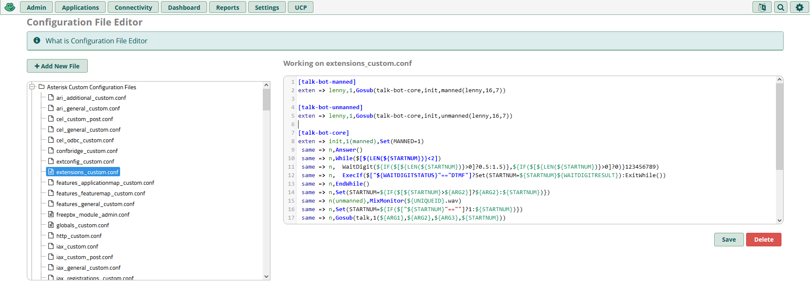
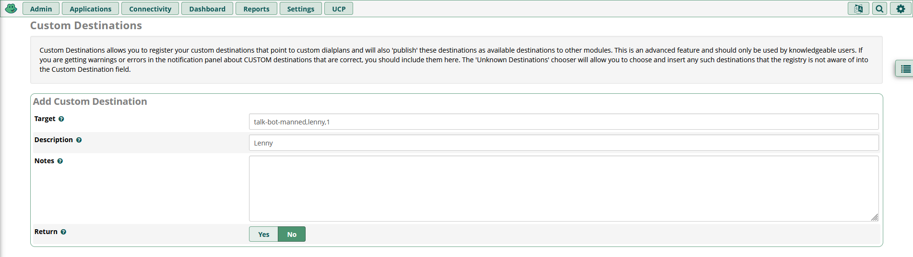
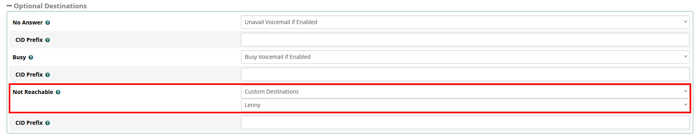
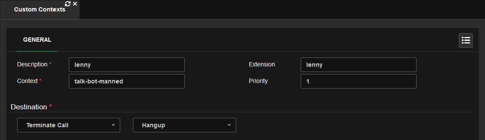

# Asterisk Extendible Talk Bot

Ever heard of [Lenny](<https://en.wikipedia.org/wiki/Lenny_(bot)>)? Considering you are reading this, chances are yes. AETB is built on top of the original Lenny code with extendibility in mind. Additionally, AETB has 2 modes:

## Unmanned

Unmanned talk bots work the same as standard Lenny. They listen for noise followed by 1.5 seconds of silence then play the next audio. This mode is intended for inbound calls.

## Manned

Manned talk bots are intended to be conferenced with other calls using a softphone like [PhonerLite](http://www.phonerlite.de/download_en.htm). They work just like unmanned talk bots but provide the following control:

-   1.5 seconds after the bot has picked up you may enter the recording number to start with on your keypad.
-   When the bot is listening you may press `#` to advance or `*` to pause.

# Adding a Talk Bot

In this guide we add manned Lenny.

<details>
<summary><h2>FreePBX</h2></summary>

1. FTP into your PBX.
2. Under `/var/lib/asterisk/sounds/` create a folder named `talk-bot`.
3. Copy the files from `audio` into the `talk-bot` folder.
4. Go to **Admin** > **Config Edit**, then copy the contents of `main.conf` into `extensions_custom.conf`. Remember to save.  
   
5. Create a custom destination with the target set to `talk-bot-manned,lenny,1`  
   
6. Create a virtual extension.  
   
7. Under **Advanced** > **Optional Destinations** set **Not Reachable** to the custom destination you created.  
   
8. Save & Apply Config. Then give the extension a call.

</details>

<details>
<summary><h2>VitalPBX</h2></summary>

1. FTP into your PBX.
2. Under `/var/lib/asterisk/sounds/` create a folder named `talk-bot`.
3. Copy the files from `audio` into the `talk-bot` folder.
4. Copy the contents of `main.conf` into `/etc/asterisk/vitalpbx/extensions__90-talk-bot.conf`.
5. Create a Custom Context with the destination set to hangup.
   
6. Create a Custom Application with the destination set to your Custom Context.
   
7. Update & Apply Config. Then give the application a call.

</details>

# Creating a Talk Bot

1. See [Editing Tips](#editing-tips), then using [ocenaudio](https://www.ocenaudio.com/) or [Audacity](https://www.audacityteam.org/) edit your recording(s) to **wav** or **mp3** clips.
2. In order number each clip from 1 to however many clips you have.
3. Run the [audio conversion script](#conversion-script) to convert the files to a suitable format.
4. In the talk bot audio folder, create a new folder named after your talk bot.
5. Copy the converted audio into the newly created folder.
6. Refer to the following on how to add your talk bot to the dialplan:

In this example a new talk bot is added whose name is Johny. It consists of 20 audio files **(Arg 2)** contained in the `johny` folder **(Arg 1)**. The loop starts on audio file 5 **(Arg 3)**. For consistency the extension is named the same as **Arg 1**.

```lisp
; main.conf

[talk-bot-manned]
exten => lenny,1,Gosub(talk-bot-core,init,manned(lenny,16,7))
exten => johny,1,Gosub(talk-bot-core,init,manned(johny,20,5)) ; new

[talk-bot-unmanned]
exten => lenny,1,Gosub(talk-bot-core,init,unmanned(lenny,16,7))
exten => johny,1,Gosub(talk-bot-core,init,unmanned(johny,20,5)) ; new
;        ^                                         ^     ^  ^
;        Extension                                 |     |  Arg 3
;                                                  |     Arg 2
; ...                                              Arg 1
```

|               |                                            |
| ------------- | ------------------------------------------ |
| **Extension** | Same as **Arg 1**.                         |
| **Arg 1**     | Name of folder containing audio files.     |
| **Arg 2**     | Number of audio files.                     |
| **Arg 3**     | On what number file should the loop begin. |

<details>
<summary><h2>Editing Tips</h2></summary>

-   At a minimum you should have around 15+ audio clips per talk bot.
-   Clips should be a sentence or two. Avoid using single word clips, especially in succession to each other.
-   Clips should be ambiguous and engaging. Questions should be open-ended and accusations broad.

</details>

<details>
<summary><h2>Conversion Script</h2></summary>

This script will convert **mp3** and **wav** files to raw audio files suitable for Asterisk (8kHz mono G.711u). You will need [FFmpeg](https://ffmpeg.org/) installed. You can then run the script in the same folder as the files you want to convert.

### Linux

```bash
output="converted"
mkdir -p $output
for file in *.mp3 *.wav; do
  name="$output/${file%.${file##*.}}.ulaw"
  ffmpeg -i "$file" -ar 8000 -ac 1 -acodec pcm_mulaw -f mulaw "$name";
done
```

### Windows

```powershell
$output = "converted"
New-Item -Path $output -ItemType Directory -Force
Get-ChildItem | where {$_.extension -in ".mp3",".wav"} | ForEach-Object {
    $name = "$output/$($_.BaseName).ulaw"
    & ffmpeg -i $_.Name -ar 8000 -ac 1 -acodec pcm_mulaw -f mulaw $name
}
```

</details>

<!--
# TODO

-   Make recordings playable in the CDR.

# Sources

-   https://github.com/VitalPBX/Telemarketers-with-Lenny
-   https://computersnstuffwaco.com/how-to-troll-telemarketers-with-lenny
-->
