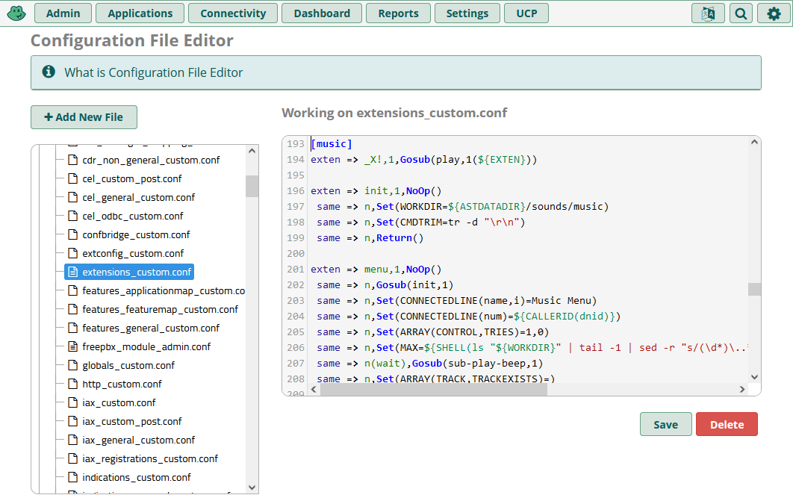
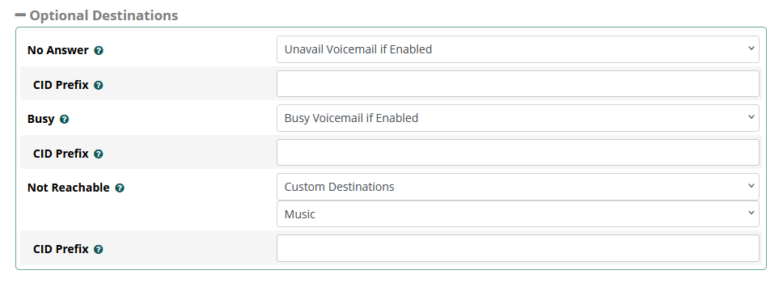
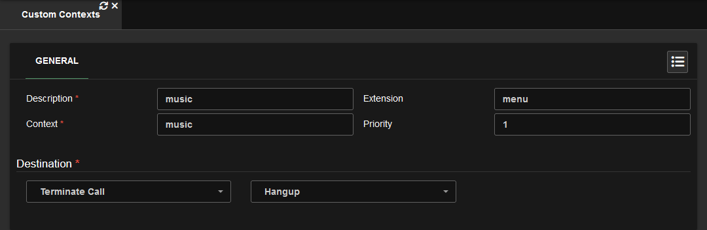
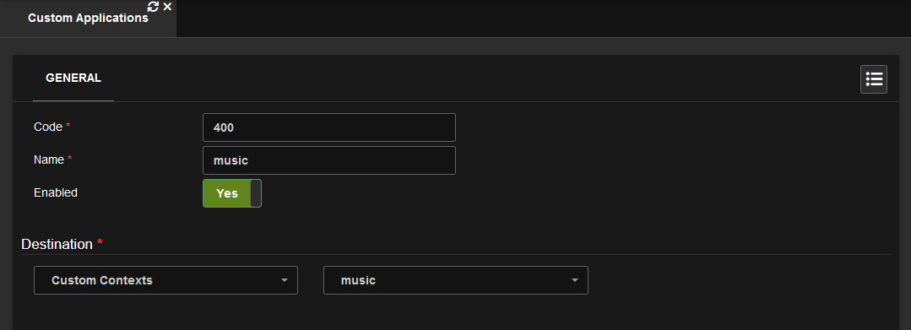
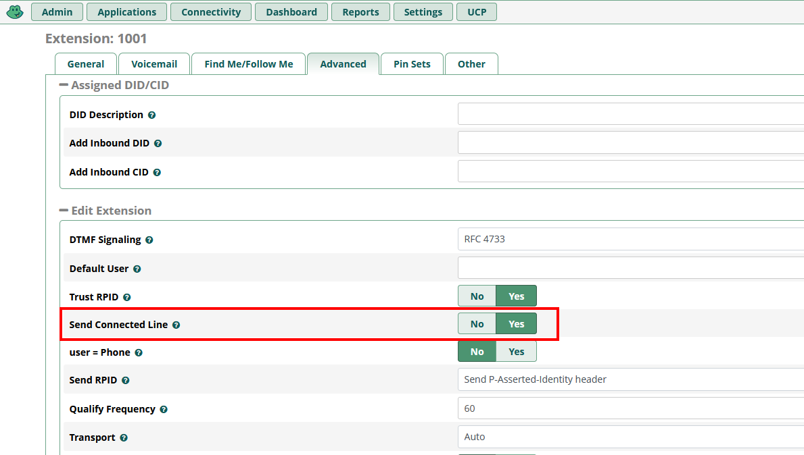

# [Asterisk Extensible] Music Player

AEMP makes it easy to add music to your PBX.

```c
EXT,X - choose track

# - ff
* - rew
0 - pause
1 - restart
2 - vol-down
3 - vol-up
5 - trk-previous
6 - trk-next
4 - tgl-repeat
7 - tgl-playlist
9 - menu
```

A playlist is a group of consecutively numbered tracks. Example: [1,2,3,4] [6,7,8,9]

# Initial Setup

This section instructs you on preparing your PBX to add music. You will only need to follow this once.

<details _open>
<summary><h3>Instructions: FreePBX</h3></summary>

1. FTP into your PBX.
2. Under `/var/lib/asterisk/sounds/` create a directory named `music`.
3. In your PBX admin navigate to **Admin** > **Config Edit**, then copy the contents of `main.conf` into `extensions_custom.conf`. Remember to save.  
   
4. Create a custom destination with the target set to `music,menu,1`. Alternatively you can put a track number instead of `menu`.
   
5. Create a virtual extension.  
   
6. Under **Advanced** > **Optional Destinations** set **Not Reachable** to the custom destination you created.  
   
7. Save & Apply Config. Then [add your music tracks](#adding-music-tracks).

</details>

<details _open>
<summary><h3>Instructions: VitalPBX</h3></summary>

1. FTP into your PBX.
2. Copy `main.conf` into `/etc/asterisk/vitalpbx/` then rename it to `extensions__90-music.conf`.
3. Under `/var/lib/asterisk/sounds/` create a directory named `music`.
4. Create a Custom Context with the destination set to hangup. Alternatively you can put a track number instead of `menu`.
   
5. Create a Custom Application with the destination set to your Custom Context.
   
6. Save & Apply Config. Then [add your music tracks](#adding-music-tracks).

</details>

# Adding Music Tracks

This section instructs you on adding music tracks. You will need to repeat these steps every time you add a new music to your PBX.

<details _open>
<summary><h3>Instructions</h3></summary>

1. Convert your music using the provided [conversion script](../#conversion-script).
2. Prepend the track numbers with a unique track number like followed by a period. Example:
    ```
    1. Track A
    2. Track B
    3. Track C
    ```
3. FTP into your PBX, then copy your named and converted tracks into `/var/lib/asterisk/sounds/music/`.
4. You can now dial the music app extension then enter a track number.

</details>

# Enabling Connected Line

For the best experience you will want to enable connected line. This will allow the track name will show up (assuming your softphone supports such functionality.)

<details _open>
<summary><h3>Instructions: FreePBX</h3></summary>

Under an extensions advanced settings enable **Send Connected Line**.


</details>

<details _open>
<summary><h3>Instructions: VitalPBX</h3></summary>

Under **Settings > Technology Settings > Device Profiles** enable **Send Connected Line** for the Default **PJSIP** and **WebRTC** profiles.


</details>
