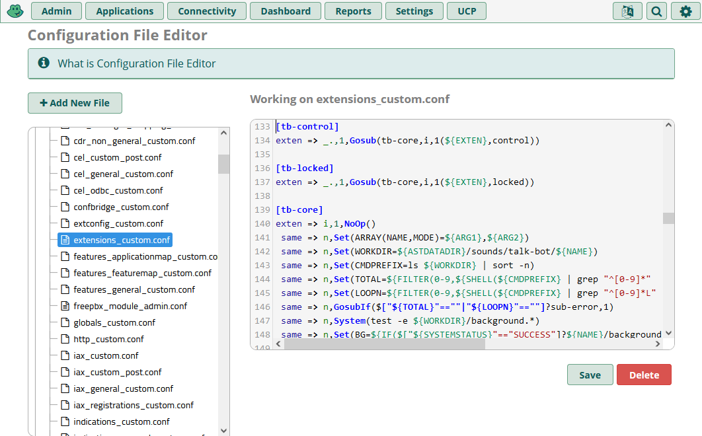
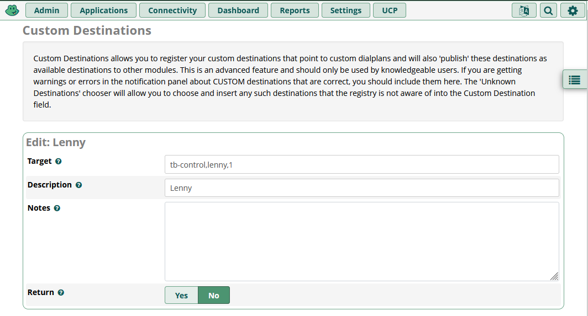
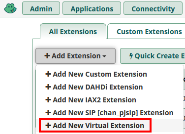
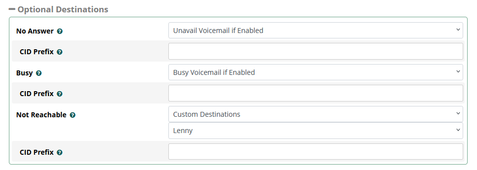
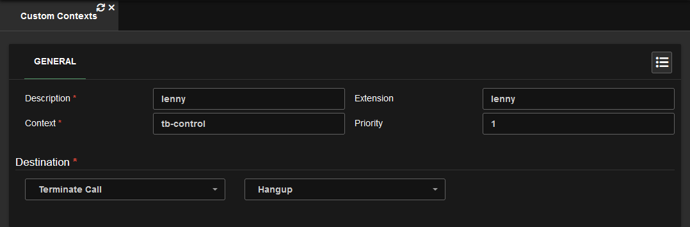
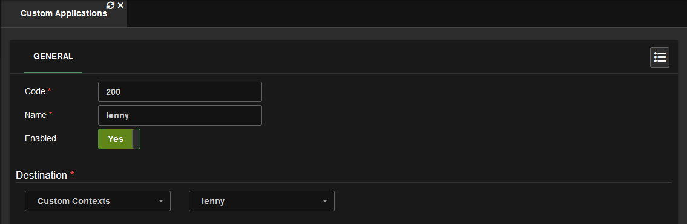

# [Asterisk Extensible] Talk Bot

Ever heard of [Lenny](<https://en.wikipedia.org/wiki/Lenny_(bot)>)? Considering you are reading this, chances are yes. AETB is built on top of the original Lenny code with extensibility in mind. Additionally, when in control mode the following controls are available:

```c
EXT,X - choose audio
EXT,0 - start listening

# - advance
* - replay
0 - pause
```

# Initial Setup

This section instructs you on preparing your PBX to add talk bots. You will only need to follow this once.

<details _open>
<summary><h3>Instructions: FreePBX</h3></summary>

1. In your PBX admin navigate to **Admin** > **Config Edit**, then copy the contents of `main.conf` into `extensions_custom.conf`. Remember to save.  
   
2. FTP into your PBX.
3. Under `/var/lib/asterisk/sounds/` create a directory named `talk-bot`.
4. Copy `audio/silence.ulaw` into the `talk-bot` directory.

</details>

<details _open>
<summary><h3>Instructions: VitalPBX</h3></summary>

1. FTP into your PBX.
2. Copy `main.conf` into `/etc/asterisk/vitalpbx/` then rename it to `extensions__90-talk-bot.conf`.
3. Under `/var/lib/asterisk/sounds/` create a directory named `talk-bot`.
4. Copy `audio/silence.ulaw` into the `talk-bot` directory.

</details>

# Adding a Talk Bot

This section instructs you on adding a talk bot, in this case Lenny. You will need to repeat these steps every time you add a new talk bot to your PBX.

<details _open>
<summary><h3>Instructions: FreePBX</h3></summary>

1. FTP into your PBX, then copy `audio/lenny/` into `/var/lib/asterisk/sounds/talk-bot/`.
2. Create a custom destination with the target set to `tb-control,lenny,1`. [Learn More](#understanding-custom-destinationcontexts-parameters).
   
3. Create a virtual extension.  
   
4. Under **Advanced** > **Optional Destinations** set **Not Reachable** to the custom destination you created.  
   
5. Save & Apply Config. Then give the extension a call.

</details>

<details _open>
<summary><h3>Instructions: VitalPBX</h3></summary>

1. FTP into your PBX, then copy `audio/lenny/` into `/var/lib/asterisk/sounds/talk-bot/`.
2. Create a Custom Context with the destination set to hangup. [Learn More](#understanding-custom-destinationcontexts-parameters).
   
3. Create a Custom Application with the destination set to your Custom Context.
   
4. Update & Apply Config. Then give the application a call.

</details>

# Creating a Talk Bot

This section instructs you on creating your own talk bots.

<details _open>
<summary><h3>Instructions</h3></summary>

1. Using [ocenaudio](https://www.ocenaudio.com/) or [Audacity](https://www.audacityteam.org/) edit your recording(s) to clips. Saving your clips as **Mono 8kHz PCM WAV** files means you won't need to convert them later.
2. If needed, run the [audio conversion script](../README.md#conversion-script) to convert the clips to a suitable format.
3. In order number each clip from 1 to however many clips you have. Put an L after the number the loop should begin on. Example:
    ```
    1.wav
    2.wav
    3.wav
    4.wav
    5L.wav         <- L for where Loop starts.
    6.wav
    7.wav
    ...
    background.wav <- Optional background noise to play when listening.
    ```
4. You can now [add your new talk bot](#adding-a-talk-bot).

</details>

# Understanding Custom Destination/Contexts Parameters

**Context:** `tb-control` or `tb-locked`.  
**Extension:** Same as folder name under `/var/lib/asterisk/sounds/talk-bot/`.  
**Priority:** Always 1.

```lisp
; FreePBX Custom Destination Target Diagram
tb-control,lenny,1
; ^        ^     ^
; |        |     Priority
; |        Extension
; Context
```
